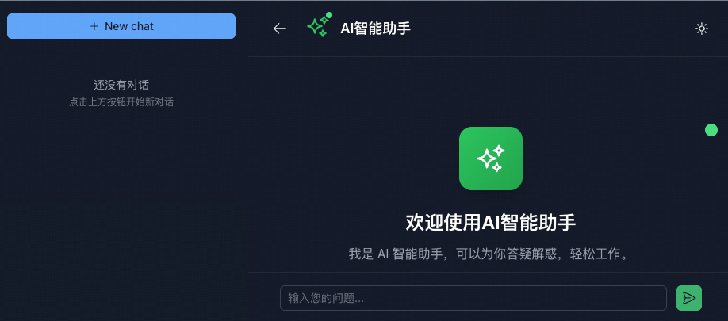

# Fust AI Chat Example

这是一个基于Spring AI 的智能聊天助手示例应用，集成了OpenAI和智谱AI的搜索工具，提供聊天对话功能。

基于 fust 框架中 fust-ai 组件，其中前端使用 Nuxt 实现并打包到 fust-ai-chat-web 中，通过 Spring Web 启动。

## 界面预览



## 环境要求

- **JDK**: 21或以上版本
- **Maven**: 3.6或以上版本
- **MySQL**: 5.7或以上版本

## 快速开始

### 1. 克隆项目

```bash
git clone https://github.com/zhihu/fust.git
cd examples/fust-ai-chat-example
```

### 2. 数据库设置

#### 2.1 创建数据库

连接到MySQL服务器，创建数据库：

```sql
CREATE DATABASE fust_ai_chat DEFAULT CHARSET utf8mb4 COLLATE utf8mb4_0900_ai_ci;
```

#### 2.2 初始化表结构

执行项目根目录下的 `db.sql` 文件：

```bash
mysql -u root -p fust_ai_chat < db.sql
```

或者在MySQL客户端中执行：

```sql
USE fust_ai_chat;
SOURCE /path/to/your/project/db.sql;
```

### 3. 配置数据库连接

确认 `fust-ai-chat-example-web/src/main/resources/db-dev.json` 中的数据库配置：

```json
[
  {
    "name": "fust_ai_chat",
    "ds": [
      {
        "name": "fust_ai_chat",
        "url": "jdbc:mysql://127.0.0.1:3306/fust_ai_chat",
        "username": "db_user",
        "password": "db_password"
      }
    ]
  }
]
```

请根据你的MySQL配置修改：

- `url`: MySQL服务地址和端口
- `username`: 数据库用户名
- `password`: 数据库密码

### 4. 配置AI服务

本应用支持多个主流云厂商的AI算力模型，包括：

- **DeepSeek（深度求索）** - 默认配置
- **字节火山方舟** - 高性能推理服务
- **阿里百炼（DashScope）** - 阿里云AI服务
- **百度千帆** - 百度AI云服务

#### 4.1 快速切换云厂商

应用提供了预配置的云厂商配置文件，位于 `fust-ai-chat-example-web/src/main/resources/` 目录：

- `deepseek.yaml` - DeepSeek配置（默认）
- `ark.yaml` - 字节火山方舟配置
- `dashscope.yml` - 阿里百炼配置
- `qianfan.yml` - 百度千帆配置

**切换方法：**

将对应的配置文件内容复制到 `application.yml` 即可切换云厂商：

```bash
# 切换到火山方舟
cp fust-ai-chat-example-web/src/main/resources/ark.yaml fust-ai-chat-example-web/src/main/resources/application.yml

# 切换到阿里百炼
cp fust-ai-chat-example-web/src/main/resources/dashscope.yml fust-ai-chat-example-web/src/main/resources/application.yml

# 切换到百度千帆
cp fust-ai-chat-example-web/src/main/resources/qianfan.yml fust-ai-chat-example-web/src/main/resources/application.yml

# 切换回DeepSeek
cp fust-ai-chat-example-web/src/main/resources/deepseek.yaml fust-ai-chat-example-web/src/main/resources/application.yml
```

#### 4.2 各云厂商配置详情

##### DeepSeek（深度求索）- 默认配置

```yaml
spring:
  ai:
    openai:
      base-url: https://api.deepseek.com/
      api-key: ${DEEPSEEK_API_KEY}
      chat:
        options:
          model: deepseek-chat
          temperature: 0.7
```

##### 字节火山方舟

```yaml
spring:
  ai:
    openai:
      base-url: https://ark.cn-beijing.volces.com/api
      api-key: ${ARK_API_KEY}
      chat:
        options:
          model: deepseek-v3-1-250821
          temperature: 0.7
```

##### 阿里百炼（DashScope）

```yaml
spring:
  ai:
    openai:
      base-url: https://dashscope.aliyuncs.com/compatible-mode
      api-key: ${DASHSCOPE_API_KEY}
      chat:
        options:
          model: qwen-plus
          temperature: 0.7
```

##### 百度千帆

```yaml
spring:
  ai:
    openai:
      base-url: https://qianfan.baidubce.com
      api-key: ${QIANFAN_API_KEY}
      chat:
        options:
          model: deepseek-v3.1-250821
          temperature: 0.7
```

#### 4.3 智谱AI配置（搜索工具）

```yaml
spring:
  ai:
    zhipu:
      api-key: ${ZHIPU_API_KEY}  # 可选，仅用于网络搜索工具
```

#### 4.4 设置环境变量

根据选择的云厂商设置对应的API Key环境变量：

```bash
# Linux/Mac
# DeepSeek
export DEEPSEEK_API_KEY=your_deepseek_api_key

# 字节火山方舟
export ARK_API_KEY=your_ark_api_key

# 阿里百炼
export DASHSCOPE_API_KEY=your_dashscope_api_key

# 百度千帆
export QIANFAN_API_KEY=your_qianfan_api_key

# 智谱AI（可选，仅用于搜索工具）
export ZHIPU_API_KEY=your_zhipu_api_key
```

```bash
# Windows
# DeepSeek
set DEEPSEEK_API_KEY=your_deepseek_api_key

# 字节火山方舟
set ARK_API_KEY=your_ark_api_key

# 阿里百炼
set DASHSCOPE_API_KEY=your_dashscope_api_key

# 百度千帆
set QIANFAN_API_KEY=your_qianfan_api_key

# 智谱AI（可选，仅用于搜索工具）
set ZHIPU_API_KEY=your_zhipu_api_key
```

**注意：**

- 只需设置当前使用的云厂商对应的API Key
- `ZHIPU_API_KEY` 是可选的，仅在需要使用网络搜索工具时配置
- 切换云厂商后需要重启应用

### 5. 编译项目

```bash
mvn clean compile
```

### 6. 启动应用

#### 方式一：打包后运行

```bash
# 打包
mvn clean package

# 运行
java -jar fust-ai-chat-example-web/target/fust-ai-chat-example-web-*.jar

```

#### 方式二：使用脚本运行

```bash
# 打包
bash build.sh

# 运行
bash run.sh services/fust-ai-chat-example-web

### 7. 验证启动

应用启动成功后，你会看到类似以下日志：

```

Started ApiMain in X.XXX seconds (JVM running for X.XXX)

```

应用默认运行在端口 `8080`，你可以通过以下方式验证：

```bash
curl http://localhost:8080/health
```

## 配置说明

### AI模型配置

应用支持多个主流云厂商的AI算力模型：

1. **DeepSeek（深度求索）**（默认）
    - 模型：`deepseek-chat`
    - API地址：`https://api.deepseek.com/`
    - 环境变量：`DEEPSEEK_API_KEY`

2. **字节火山方舟**
    - 模型：`deepseek-v3-1-250821`
    - API地址：`https://ark.cn-beijing.volces.com/api`
    - 环境变量：`ARK_API_KEY`

3. **阿里百炼（DashScope）**
    - 模型：`qwen-plus`
    - API地址：`https://dashscope.aliyuncs.com/compatible-mode`
    - 环境变量：`DASHSCOPE_API_KEY`

4. **百度千帆**
    - 模型：`deepseek-v3.1-250821`
    - API地址：`https://qianfan.baidubce.com`
    - 环境变量：`QIANFAN_API_KEY`

5. **智谱AI**（搜索工具）
    - 仅用于网络搜索功能
    - 环境变量：`ZHIPU_API_KEY`（可选）

**切换云厂商：**

- 复制对应的配置文件到 `application.yml` 即可切换
- 支持的配置文件：`deepseek.yaml`、`ark.yaml`、`dashscope.yml`、`qianfan.yml`
- 所有云厂商均基于OpenAI兼容协议，切换简单便捷

### AI工具配置

应用集成了智谱AI的网络搜索工具 `ZhipuWebSearchTool`，用于增强AI助手的搜索能力。

**关于ZHIPU_API_KEY配置：**

- 如果你需要使用网络搜索功能，请配置 `ZHIPU_API_KEY` 环境变量
- 如果不需要搜索功能，可以不配置此环境变量

### 系统提示词

可以在 `application.yml` 中的 `ai.chat.web.system.prompt` 部分自定义系统提示词，以调整AI助手的行为和回答风格。

## 数据库表结构

### chat_history

聊天历史记录表

- `id`: 主键
- `conversation_id`: 会话ID
- `type`: 消息类型（user/assistant/system/custom）
- `content`: 消息内容
- `metadata`: 元数据
- `created_at`: 创建时间
- `updated_at`: 更新时间

### user_chat_session

用户对话会话表

- `id`: 主键
- `user_id`: 用户ID
- `conversation_id`: 会话ID
- `title`: 对话标题
- `created_at`: 创建时间
- `updated_at`: 更新时间

## 开发说明

- 主入口类：`com.zhihu.fust.example.api.ApiMain`
- 主配置文件：`fust-ai-chat-example-web/src/main/resources/application.yml`
- 云厂商配置文件：
    - `fust-ai-chat-example-web/src/main/resources/deepseek.yaml` - DeepSeek配置
    - `fust-ai-chat-example-web/src/main/resources/ark.yaml` - 字节火山方舟配置
    - `fust-ai-chat-example-web/src/main/resources/dashscope.yml` - 阿里百炼配置
    - `fust-ai-chat-example-web/src/main/resources/qianfan.yml` - 百度千帆配置
- 数据库配置：`fust-ai-chat-example-web/src/main/resources/db-dev.json`

## 企业工具集成指南

本应用基于Spring AI框架，支持灵活的工具集成，让你可以快速接入企业内部已有的工具和服务。

### 工具集成原理

应用通过Spring AI的Function Calling机制实现工具调用：

1. **工具定义**: 创建实现特定接口的工具类
2. **工具注册**: 在`ApiMain.tools()`方法中注册工具
3. **自动调用**: AI模型根据用户输入自动选择合适的工具

### 创建自定义工具

#### 步骤1：创建工具类

以企业内部API查询工具为例：

```java

@Component
@Description("查询企业内部员工信息的工具")
public class EmployeeSearchTool implements Function<EmployeeSearchTool.Request, EmployeeSearchTool.Response> {

    @JsonClassDescription("员工查询请求参数")
    public record Request(
            @JsonPropertyDescription("员工姓名或工号") String query
    ) {
    }

    @JsonClassDescription("员工信息响应")
    public record Response(
            String employeeId,
            String name,
            String department,
            String email
    ) {
    }

    @Override
    public Response apply(Request request) {
        // 调用企业内部API
        // 这里可以集成你的内部服务，如：
        // - HTTP API调用
        // - 数据库查询
        // - 文件系统操作
        // - 消息队列发送等

        return queryEmployeeFromInternalAPI(request.query());
    }

    private Response queryEmployeeFromInternalAPI(String query) {
        // 实际的API调用逻辑
        // 例如：RestTemplate、WebClient、MyBatis等
        return new Response("E001", "张三", "技术部", "zhangsan@company.com");
    }
}
```

#### 步骤2：注册工具

在`ApiMain.java`中的`tools()`方法里添加你的工具：

```java
public List<Object> tools() {
    var tools = new ArrayList<>();

    // 现有工具
    tools.add(new ZhipuWebSearchTool());

    // 添加你的企业工具
    tools.add(new EmployeeSearchTool());
    tools.add(new DocumentSearchTool());
    tools.add(new WorkflowTriggerTool());

    return tools;
}
```
